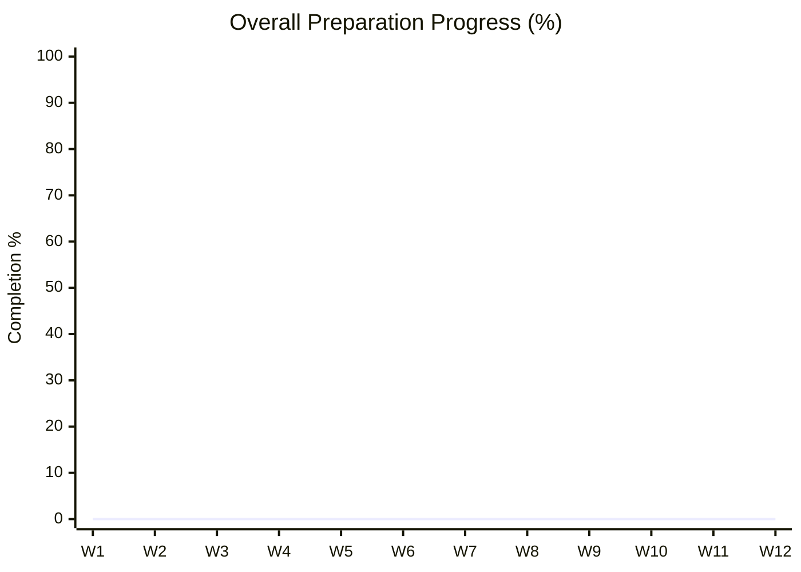
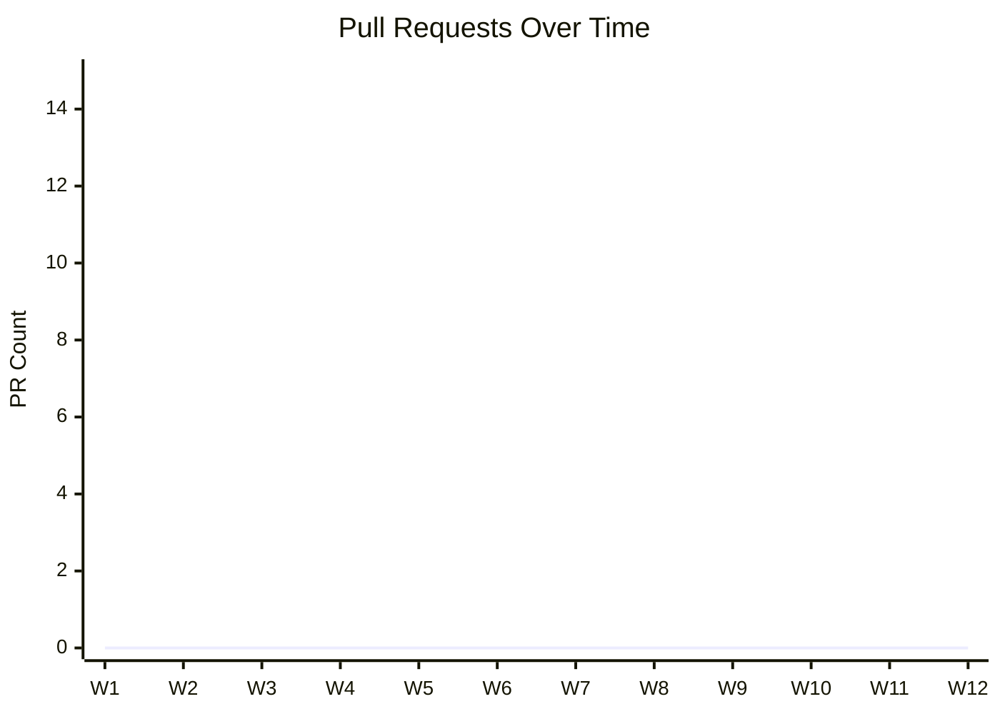
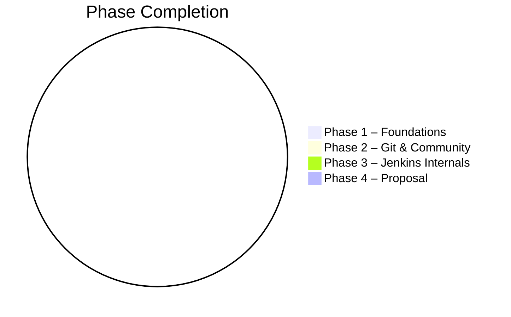

# JENKINS-GSoC-2026
---
# 🚀 Jenkins GSoC 2026 – Daily Preparation Roadmap

> A **85-day, day-by-day preparation plan** for Google Summer of Code 2026 with Jenkins, focused on fundamentals, real contributions, and proposal readiness.

This repository documents my structured preparation journey and serves as verifiable proof of learning, execution, and community engagement.

---

## 🎯 Goal

- **Program:** Google Summer of Code 2026
- **Target Organization:** Jenkins
- **Background:** Computer Science student, building open-source experience 
- **Objective:** Become a contributing Jenkins developer and submit a strong, mentor-approved proposal
- **Approach:** Daily execution + weekly reflection + real pull requests

---

## 📁 Repository Structure

```text
jenkins-gsoc-2026/
│
├── README.md                 # Main roadmap (this file)
├── CONTRIBUTIONS.md          # All PRs, issues, community links
│
├── weekly-logs/              # Weekly execution & reflections
│   ├── week-01.md
│   ├── week-02.md
│   ├── week-03.md
│   ├── week-04.md
│   ├── week-05.md
│   ├── week-06.md
│   ├── week-07.md
│   ├── week-08.md
│   ├── week-09.md
│   ├── week-10.md
│   ├── week-11.md
│   └── week-12.md            # Final preparation & proposal submission
│
├── poc/                      # Proof of Concept for proposal
│   └── README.md
│
└── proposal/                 # GSoC proposal drafts
    ├── draft.md
    └── final.pdf
```
---

## 🔗 Jenkins Resources

- [ ] Join Jenkins Chat (Matrix/Gitter): https://www.jenkins.io/chat/
- [ ] Create Jenkins Discourse account: https://community.jenkins.io/
- [ ] Bookmark Jenkins Jira: https://issues.jenkins.io/
- [ ] Bookmark Developer Docs: https://www.jenkins.io/doc/developer/

---

## 📌 Contribution Rules

- [ ] Day 1–30: PR attempt every **4 days**
- [ ] Day 31–75: PR attempt every **7 days**
- [ ] Community interaction starts from **Day 1**
- [ ] Every PR attempt is documented in `CONTRIBUTIONS.md`

---

---

## 📈 Contribution Tracker (Live)

Detailed and updated list available in [`CONTRIBUTIONS.md`](./CONTRIBUTIONS.md)

| Milestone | Status |
|---------|--------|
| First Jenkins Community Introduction | ⬜ |
| First Discourse Post | ⬜ |
| Docs / Typo PR | ⬜ |
| Javadoc / Style PR | ⬜ |
| Unit Test PR | ⬜ |
| Bug Fix PR | ⬜ |
| Code Modernization PR | ⬜ |
| GSoC Proposal Submission | ⬜ |

---

## 🗓️ 85-Day Preparation Roadmap

# 🗓️ Day-by-Day Checklist (85 Days)

## 🧩 Phase 1: Java & Linux Foundations  
### **24-12-2025 → 07-01-2026**

### 24-12-2025
- [ ] Install OpenJDK 17/21
- [ ] Install Maven
- [ ] Install Git
- [ ] Install IntelliJ IDEA
- [ ] Verify installations

### 25-12-2025
- [ ] Learn `cd`, `ls`, `pwd`
- [ ] Learn `mkdir`, `cp`, `mv`, `rm`
- [ ] Practice terminal navigation

### 26-12-2025
- [ ] Write `HelloWorld.java`
- [ ] Compile using `javac`
- [ ] Run using `java`
- [ ] Push code to GitHub

### 27-12-2025 — PR Attempt #1
- [ ] Join Jenkins Matrix/Gitter
- [ ] Fork `jenkins-infra/jenkins.io`
- [ ] Fix typo / broken link
- [ ] Open Pull Request

### 28-12-2025
- [ ] Learn Java primitive types
- [ ] Learn reference types
- [ ] Practice small programs

### 29-12-2025
- [ ] Practice `if-else`
- [ ] Practice `switch`
- [ ] Debug logical errors

### 30-12-2025
- [ ] Practice `for` and `while` loops
- [ ] Solve loop-based problems

### 31-12-2025 — PR Attempt #2
- [ ] Improve Jenkins documentation wording
- [ ] Respond to review comments
- [ ] Reply to one community message

### 01-01-2026
- [ ] Learn arrays
- [ ] Traverse arrays
- [ ] Solve array problems

### 02-01-2026
- [ ] Define methods
- [ ] Pass parameters
- [ ] Practice method overloading

### 03-01-2026
- [ ] Create classes
- [ ] Use constructors
- [ ] Understand object lifecycle

### 04-01-2026 — PR Attempt #3
- [ ] Add Javadoc to Jenkins plugin
- [ ] Update CONTRIBUTIONS.md

### 05-01-2026
- [ ] Learn inheritance
- [ ] Use `extends` and `super`

### 06-01-2026
- [ ] Learn interfaces
- [ ] Understand loose coupling
- [ ] Read Jenkins extension-point docs

### 07-01-2026
- [ ] Design CLI Library System
- [ ] Apply OOP concepts
- [ ] Push project to GitHub

---

## 🔧 Phase 2: Git, Jenkins Basics & Community  
### **08-01-2026 → 22-01-2026**

### 08-01-2026 — PR Attempt #4
- [ ] Configure Git (username, email, SSH)
- [ ] Fix Jenkins documentation issue

### 09-01-2026
- [ ] Learn `git log`, `git diff`
- [ ] Practice clean commits

### 10-01-2026
- [ ] Create feature branches
- [ ] Merge branches
- [ ] Resolve conflicts

### 11-01-2026
- [ ] Improve README of personal repo
- [ ] Add `.gitignore`

### 12-01-2026 — PR Attempt #5
- [ ] Create Jenkins Discourse post
- [ ] Submit small doc PR

### 13-01-2026
- [ ] Learn Maven `pom.xml`
- [ ] Understand dependencies

### 14-01-2026
- [ ] Run `mvn clean install`
- [ ] Fix build issues

### 15-01-2026
- [ ] Run Jenkins locally (`jenkins.war`)
- [ ] Explore Jenkins dashboard

### 16-01-2026 — PR Attempt #6
- [ ] Improve Jenkins plugin README
- [ ] Comment on someone else’s PR

### 17-01-2026
- [ ] Create Jenkins Pipeline job
- [ ] Write basic Jenkinsfile

### 18-01-2026
- [ ] Explore Manage Jenkins
- [ ] Install common plugins

---

## 🧠 Phase 3: Jenkins Internals & Real Contributions  
### **19-01-2026 → 19-02-2026**  
*(Org applications open during this phase)*

### 19-01-2026
- [ ] Study Jenkins architecture
- [ ] Read core concepts

### 20-01-2026
- [ ] Learn Stapler framework
- [ ] Trace URL-to-Java flow

### 21-01-2026
- [ ] Learn Jelly UI basics
- [ ] Modify sample Jelly view

### 22-01-2026 — PR Attempt #7
- [ ] Submit small refactor or test PR
- [ ] Attend Jenkins SIG (observer)

### 23-01-2026
- [ ] Clone Jenkins core repository
- [ ] Explore project structure

### 24-01-2026
- [ ] Build Jenkins locally
- [ ] Resolve build issues

### 25-01-2026
- [ ] Study extension points
- [ ] Identify plugin hooks

### 26-01-2026
- [ ] Browse beginner-friendly Jira issues

### 27-01-2026 — PR Attempt #8
- [ ] Add unit test to Jenkins plugin
- [ ] Learn JUnit 5 basics

### 28-01-2026
- [ ] Reproduce selected bug
- [ ] Document reproduction steps

### 29-01-2026
- [ ] Write failing test
- [ ] Confirm test failure

### 30-01-2026
- [ ] Fix bug
- [ ] Validate locally

### 31-01-2026 — PR Attempt #9
- [ ] Submit bug-fix PR
- [ ] Respond to feedback

### 01-02-2026
- [ ] Learn declarative pipelines
- [ ] Modify Jenkinsfile examples

### 02-02-2026
- [ ] Learn Controller vs Agent
- [ ] Read distributed Jenkins docs

### 03-02-2026
- [ ] Review org application period
- [ ] Summarize progress

### 19-02-2026
- [ ] Review accepted org list
- [ ] Confirm Jenkins participation

---

## 📝 Phase 4: Proposal & Contributor Application  
### **20-02-2026 → 18-03-2026**

### 20-02-2026
- [ ] Review Jenkins GSoC project ideas
- [ ] Read previous proposals

### 21-02-2026
- [ ] Shortlist top 3 ideas
- [ ] Evaluate feasibility

### 22-02-2026
- [ ] Select final idea
- [ ] Gather references

### 23-02-2026 — PR Attempt #10
- [ ] Contribution related to chosen idea
- [ ] Inform mentor

### 24-02-2026
- [ ] Start Proof of Concept
- [ ] Push initial code

### 25-02-2026
- [ ] Complete PoC
- [ ] Document approach

### 26-02-2026
- [ ] Draft About Me section
- [ ] List contributions

### 27-02-2026
- [ ] Write problem statement
- [ ] Define goals

### 28-02-2026
- [ ] Design 12-week timeline
- [ ] Define deliverables

### 01-03-2026 — PR Attempt #11
- [ ] Quality-of-life PR
- [ ] Thank reviewers

### 02-03-2026
- [ ] Share proposal draft with mentors
- [ ] Collect feedback

### 03-03-2026
- [ ] Apply mentor feedback
- [ ] Improve technical depth

### 04-03-2026
- [ ] Add diagrams
- [ ] Improve clarity

### 05-03-2026
- [ ] Proofread proposal
- [ ] Grammar and formatting check

### 06-03-2026
- [ ] Final mentor review
- [ ] Lock proposal content

### 16-03-2026
- [ ] Submit proposal on GSoC portal

### 18-03-2026
- [ ] Final reflection
- [ ] Archive preparation repo

---

## 📝 Weekly Logs

Weekly execution and reflections are maintained in `weekly-logs/`.

---

## 📌 Notes for Mentors

- Repository is actively maintained
- All claims are backed by links
- Contributions align with Jenkins roadmap

---

## ✅ Status

- [ ] Preparation Ongoing
- [ ] Contributions Active
- [ ] Proposal Submitted

---

## 📊 Progress Dashboard

### 🔢 Live Metrics (Auto-calculated)
> Source of truth: `progress.json` (updated by GitHub Actions)

| Metric | Value |
|------|------|
| Tasks Completed | 1 |
| Tasks Remaining | 0 |
| Completion % | 100% |
| Pull Requests | 0 |

---

### ⭐ Final Note

This repository represents long-term commitment to open-source engineering and the Jenkins community.

Thank you for reviewing.

### 📈 Overall Completion Trend




### 🧩 Pull Requests Over Time




### 📌 Phase-wise Progress




